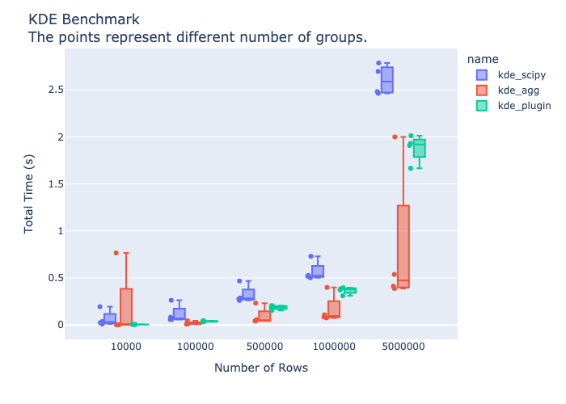

# polars_kde  

[](https://badge.fury.io/py/polars-kde)

Provides Kernel Density Estimation (KDE) functionalities as [Polars](https://www.pola.rs/) Plugin.
Under the hood it uses the [kernel_density_estimation](https://docs.rs/kernel-density-estimation/latest/kernel_density_estimation/kde/index.html) crate.

## Table of Contents

- [Installation](#installation)
- [Examples](#examples)
- [Benchmark](#benchmark)
- [Limitations and further improvements](#limitations-and-further-improvements)

## Installation

Install `polars_kde` using `pip` or `uv`:

```bash
pip install polars_kde
# or 
uv add polars_kde
```

See [uv](https://docs.astral.sh/uv/) for more information on how to use `uv` to manage your Python dependencies.


## Examples

Here are some examples of how to use `polars_kde`. The library provides three main methods to calculate KDE's:

1. **Static Evaluations**: This method calculates KDE's at a fixed set of evaluation points for each group. Works an already aggregated Data of type `pl.List(pl.Float32)`.

2. **Aggregated KDE**: This method calculates KDE's at a fixed set of evaluation points for each group and aggregates the results. Works on grouped DataFrames, where each group contains the data of type `pl.Float32`.

3. **Dynamic Evaluations**: This method calculates KDE's at a variable set of evaluation points for each group. Works on already aggregated Data of type `pl.List(pl.Float32)`.

In most scenarios, you will probably want to use the `kde` method, which works grouped dataframes and parallelizes the KDE calculations across groups.

### Example 1: Static Evaluations

```python
import polars as pl
import polars_kde as pkde

# Sample DataFrame with a as pl.Float32
df = pl.DataFrame(
    {
        "a": [1.0, 2.0, 3.0, 4.0, 5.0],
        "id": [0, 0, 1, 1, 1],
    },
    schema={"a": pl.Float32, "id": pl.Int32},  # Explicitly set the dtypes
)

# Evaluation points
eval_points = [1.0, 2.0, 3.0, 4.0, 5.0]

# Group by 'id' and apply KDE
df_kde = (
    df
    .group_by("id")
    .agg(
        "a"
    )
    .with_columns(
        kde=pkde.kde_static_evals(
            "a",
            eval_points=eval_points,
        )
    )
)

print(df_kde)
```

### Example 2: Aggregated KDE

```python
import polars as pl
import polars_kde as pkde

# Sample DataFrame with a as pl.Float32
df = pl.DataFrame(
    {
        "a": [1.0, 2.0, 3.0, 4.0, 5.0],
        "id": [0, 0, 1, 1, 1],
    },
    schema={"a": pl.Float32, "id": pl.Int32},  # explicitly set the dtypes
)

# Evaluation points
eval_points = [1.0, 2.0, 3.0, 4.0, 5.0]

# Group by 'id' and apply aggregated KDE
df_kde = (
    df
    .group_by("id")
    .agg(
        kde=pkde.kde(
            "a",
            eval_points=eval_points,
        )
    )
)

print(df_kde)
```


### Example 3: Dynamic Evaluations

```python
import polars as pl
import polars_kde as pkde

# Sample DataFrame with a as pl.List(pl.Float32)
df = pl.DataFrame(
    {
        "a": [[1.0, 2.0, 3.0], [4.0, 5.0, 6.0]],
        "eval_points": [[1.0, 2.0, 3.0], [4.0, 5.0, 6.0]],
    },
    schema={"a": pl.List(pl.Float32), "eval_points": pl.List(pl.Float32)},
)

# Apply dynamic KDE evaluations
df_kde = (
    df
    .with_columns(
        kde=pkde.kde_dynamic_evals(
            "a",
            "eval_points",
        )
    )
)

print(df_kde)
```

## Benchmark

After various tests and experiments, it turns out that it is usually a good idea to use `kde` to calculate KDE's. By the  construction of polars, the single groups handled in parallel.

The following non representative benchmark compares the performance of different KDE implementations using various DataFrame sizes. We also compare against the `scipy` implementation, wich is not parallelized and applied using `map_elements` in polars.



The benchmark evaluates the total time taken for KDE computations across different numbers of rows and groups. If we have say 1000 rows and 10 groups, we calculate the KDE for each of the groups and get 10 KDE's evaluated at a fixed set of evaluation points. Note that `kde_dynamic_evals` also allows for a variable number of evaluation points per group.

If you want to run the benchmark yourself, you can use the following command:

```bash
make bench
```

**NOTE:** The `benchmark.py` file is actually a [marimo](https://marimo.app) notebook. Since it was created in sandbox mode the dependencies are part of the header information and we do not need to include any additional dependencies in the `pyproject.toml` file. Great.

## Limitations and further improvements

- The current implementation only supports float32 dtypes and uses the Gaussian kernel with Silverman bandwith estimation. Should be extended to support various kernels, bandwiths and dtypes.
- The current implementation only supports 1D KDE's. Should be extended to support 2D KDE's.
- The underlying rust implementation is not yet optimized for performance, especially for large datasets.