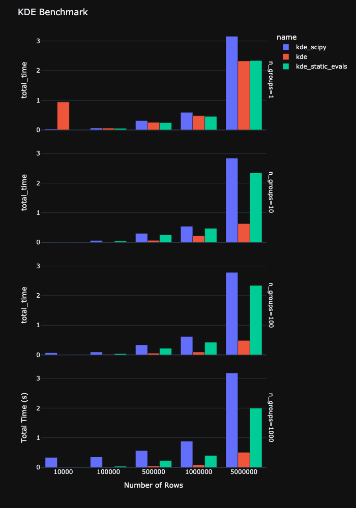

# Polars KDE

Polars KDE provides Kernel Density Estimation (KDE) functionalities powered by the [Polars](https://www.pola.rs/) DataFrame library.

## Table of Contents

- [Installation](#installation)
- [Examples](#examples)
- [Benchmark](#benchmark)
- [License](#license)

## Installation

Install the Polars KDE package using pip:

```bash
uv add polars_kde
```
or 
```bash
pip install polars_kde
```

## Examples

Here are some examples of how to use Polars KDE. In general there are three methods to calculate KDE's:

1. **Static Evaluations**: This method calculates KDE's at a fixed set of evaluation points for each group. Works an already aggregated Data of type `pl.List(pl.Float32)`.
2. **Aggregated KDE**: This method calculates KDE's at a fixed set of evaluation points for each group and aggregates the results. Works on grouped DataFrames, where each group contains the data of type `pl.Float32`.
3. **Dynamic Evaluations**: This method calculates KDE's at a variable set of evaluation points for each group. Works on already aggregated Data of type `pl.List(pl.Float32)`.

### Example 1: Static Evaluations

```python
import polars as pl
import polars_kde as pkde

# Sample DataFrame with a as pl.Float32
df = pl.DataFrame(
    {
        "a": [1.0, 2.0, 3.0, 4.0, 5.0],
        "id": [0, 0, 1, 1, 1],
    },
    schema={"a": pl.Float32, "id": pl.Int32},  # Explicitly set the dtypes
)

# Evaluation points
eval_points = [1.0, 2.0, 3.0, 4.0, 5.0]

# Group by 'id' and apply KDE
df_kde = df.group_by("id").agg(
    pl.col("a")
).with_columns(
    kde=pkde.kde_static_evals(
        pl.col("a"),
        eval_points=eval_points,
    )
)

print(df_kde)
```

### Example 2: Aggregated KDE

```python
import polars as pl
import polars_kde as pkde

# Sample DataFrame with a as pl.Float32
df = pl.DataFrame(
    {
        "a": [1.0, 2.0, 3.0, 4.0, 5.0],
        "id": [0, 0, 1, 1, 1],
    },
    schema={"a": pl.Float32, "id": pl.Int32},  # explicitly set the dtypes
)

# Evaluation points
eval_points = [1.0, 2.0, 3.0, 4.0, 5.0]

# Group by 'id' and apply aggregated KDE
df_kde = df.group_by("id").agg(
    kde=pkde.kde_agg(
        pl.col("a"),
        eval_points=eval_points,
    )
)

print(df_kde)
```


### Example 3: Dynamic Evaluations

```python
import polars as pl
import polars_kde as pkde

# Sample DataFrame with a as pl.List(pl.Float32)
df = pl.DataFrame(
    {
        "a": [[1.0, 2.0, 3.0], [4.0, 5.0, 6.0]],
        "eval_points": [[1.0, 2.0, 3.0], [4.0, 5.0, 6.0]],
    },
    schema={"a": pl.List(pl.Float32), "eval_points": pl.List(pl.Float32)},
)

# Apply dynamic KDE evaluations
df_kde = df.with_columns(
    kde=pkde.kde_dynamic_evals(
        pl.col("a"),
        pl.col("eval_points"),
    )
)

print(df_kde)
```

## Benchmark

After various tests and experiments, it turns out that it is usually a good idea to use `kde_agg` to calculate KDE's. By the  construction of polars, the single groups handled in parallel.

The following non representative benchmark compares the performance of different KDE implementations using various DataFrame sizes. We also compare against the `scipy` implementation, wich is not parallelized and applied using `map_elements` in polars.



The benchmark evaluates the total time taken for KDE computations across different numbers of rows and groups. If we have say 1000 rows and 10 groups, we calculate the KDE for each of the groups and get 10 KDE's evaluated at a fixed set of evaluation points. Note that `kde_dynamic_evals` also allows for a variable number of evaluation points per group.

If you want to run the benchmark yourself, you can use the following command:

```bash
make bench
```

NOTE: The `benchmark.py` file is actually a [marimo](https://marimo.app) notebook. Since it was created in sandbox mode the dependencies are part of the header information and we do not need to include any additional dependencies in the `pyproject.toml` file. Great.

## License

This project is licensed under the MIT License. See the [LICENSE](LICENSE) file for details.

Polars KDE provides Kernel Density Estimation (KDE) functionalities powered by the [Polars](https://www.pola.rs/) DataFrame library.
